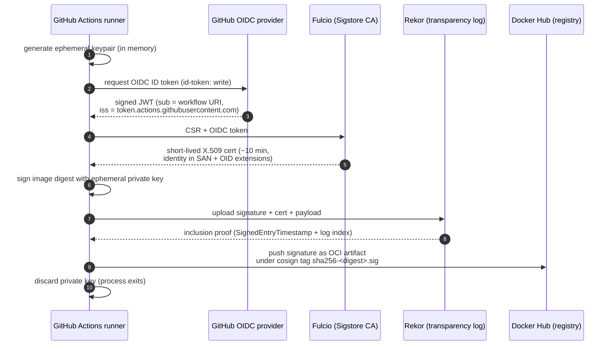

# Image Signing with Cosign

This document describes how Runpod container images are signed and how consumers
verify those signatures. We use [Cosign](https://github.com/sigstore/cosign)
against the public [Sigstore](https://www.sigstore.dev/) infrastructure
(Fulcio CA + Rekor transparency log), driven by GitHub Actions OIDC — i.e.
**keyless signing**.

Contents:

1. [Key material and trust model](#1-key-material-and-trust-model)
2. [Signing process (CI)](#2-signing-process-ci)
3. [Verification process (consumers)](#3-verification-process-consumers)
4. [Attestation artifacts produced by CI](#4-attestation-artifacts-produced-by-ci)
5. [Maintenance and runbooks](#5-maintenance-and-runbooks)
6. [Troubleshooting](#6-troubleshooting)

---

## 1. Key material and trust model

### TL;DR

- **No long-lived private signing keys exist** anywhere in this repository, in
GitHub Secrets, on Runpod machines, or in any vault. There is nothing to
rotate, back up, or leak.
- Every signing run mints a **fresh ephemeral key pair on the GitHub Actions
runner**, uses it once, and discards it when the runner shuts down.
- Trust is anchored in (a) the **public Sigstore PKI** (Fulcio + Rekor) and
(b) the **GitHub OIDC identity** of the workflow that signed the image,
enforced via the regex policy consumers pass to `cosign verify`.

### What "keyless" actually means




Per signing event the runner produces:


| Artifact               | Lifetime                | Stored where                                          |
| ---------------------- | ----------------------- | ----------------------------------------------------- |
| Ephemeral private key  | seconds (runner RAM)    | nowhere — discarded with the runner                   |
| Short-lived X.509 cert | ~10 minutes (validity)  | embedded inside the OCI signature artifact            |
| OIDC ID token          | seconds                 | not persisted; only sent to Fulcio                    |
| Signature blob         | permanent               | OCI artifact next to the image: `sha256-<digest>.sig` |
| Rekor log entry        | permanent (append-only) | `https://rekor.sigstore.dev` (publicly auditable)     |


### Where the "CA" lives

We do **not** operate our own CA. The CA stack is Sigstore public-good
infrastructure:


| Component           | Operator                            | Endpoint                                                    | Role                                                              |
| ------------------- | ----------------------------------- | ----------------------------------------------------------- | ----------------------------------------------------------------- |
| Fulcio              | Sigstore project (Linux Foundation) | `https://fulcio.sigstore.dev`                               | Issues short-lived code-signing certs from OIDC identities.       |
| Rekor               | Sigstore project (Linux Foundation) | `https://rekor.sigstore.dev`                                | Append-only public log of all signatures.                         |
| Root of trust (TUF) | Sigstore project                    | bundled inside cosign + `https://tuf-repo-cdn.sigstore.dev` | Distributes Fulcio root cert + Rekor public key, rotated via TUF. |


Cosign ships the Sigstore TUF root **inside the binary**. Upgrading cosign
automatically picks up any upstream rotation — see [§5.1](#51-cosign-version-upgrade-every-612-months-or-on-cve).

### What is secret?

**Nothing on our side.** No shared secret, signing key, or HSM. What we
*do* depend on:

- The **integrity of GitHub's OIDC issuer** (`token.actions.githubusercontent.com`).
If compromised, an attacker could mint tokens that impersonate this repo's
workflows. That is an industry-wide incident, not something we can
unilaterally mitigate.
- The `**id-token: write` permission** declared on signing workflows. Any
workflow in this repo with that permission can request an OIDC token whose
`sub` points at its own workflow URI. Branch protection on `main` and PR
review gate what code can introduce or modify such a workflow.
- The **verification policy** consumers pin (regex + issuer). A loose regex
defeats the whole scheme; see [§3](#3-verification-process-consumers).

### Identity baked into each signature

After signing, the certificate's SAN encodes the GitHub workflow URI, e.g.:

```
https://github.com/runpod/containers/.github/workflows/base.yml@refs/heads/main
```

and the X.509 extensions under OID `1.3.6.1.4.1.57264.1.*` carry repository,
workflow name, ref, commit SHA, and trigger. This is exactly what
`--certificate-identity-regexp` matches against during verification.

---

## 2. Signing process (CI)

### Where it is implemented


| File                                    | Purpose                                                                      |
| --------------------------------------- | ---------------------------------------------------------------------------- |
| `.github/actions/cosign/action.yml`     | Reusable sign + verify composite action.                                     |
| `.github/actions/image-name/action.yml` | Extracts `<image>@sha256:<digest>` pairs from `docker buildx bake` metadata. |
| `.github/workflows/base.yml`            | Builds and signs `runpod/base`, `runpod/pytorch`, `runpod/autoresearch`.     |
| `.github/workflows/nvidia.yml`          | Builds and signs `runpod/nvidia-*` images.                                   |
| `.github/workflows/rocm.yml`            | Builds and signs `runpod/rocm` images.                                       |


Each signing workflow declares the permissions cosign keyless requires:

```yaml
permissions:
  contents: read
  id-token: write   # required to request the OIDC token consumed by Fulcio
```

### Pipeline order

```
docker/bake-action  →  image-name (extract digests)  →  grype  →  cosign-installer (pinned)  →  cosign action (sign + verify)
```

The cosign step always runs **after** the image push, against the immutable
digest returned by buildx.

### What the cosign action does

For each `<registry>/<image>@sha256:<digest>` in the JSON array passed by
`image-name`, the action runs:

```bash
cosign sign --yes "${ref}"

cosign verify \
  --certificate-identity-regexp "^${GITHUB_SERVER_URL}/${GITHUB_REPOSITORY}/\.github/workflows/.+" \
  --certificate-oidc-issuer "https://token.actions.githubusercontent.com" \
  "${ref}"
```

Notes:

- `--yes` is non-interactive consent to the Sigstore Terms of Service — that
is the only reason `cosign sign` would otherwise prompt. It does **not**
affect what gets signed.
- No `--key` is passed → cosign 2.x defaults to keyless / OIDC.
- The `verify` step in the same job is a smoke test: a malformed signature or
a regex mismatch fails the build immediately rather than landing a broken
signature in production.
- Signatures are written to Docker Hub next to the image as
`docker.io/runpod/<image>:sha256-<digest>.sig`.

### Why we sign the digest, not the tag

Cosign binds signatures to the immutable `sha256:` digest. Tags
(`1.0.6-ubuntu2204`, `latest`, …) can be moved at any time; a signature on a
tag would be meaningless. `image-name` outputs the digest form, and that is
what we pass to both `cosign sign` and `cosign verify` in CI — and what
consumers should verify too.

---

## 3. Verification process (consumers)

### Prerequisites

- `cosign` ≥ 2.0 — we run 2.6.x in CI. Install via `brew install cosign`,
your distro's package manager, or
[the upstream releases page](https://github.com/sigstore/cosign/releases).
- Anything that can resolve `image:tag → sha256:digest`. Docker / buildx is
the path of least resistance; `crane digest` is a lighter alternative if
the Docker daemon is not available.

### Step-by-step

```bash
IMAGE="docker.io/runpod/base:1.0.6-ubuntu2204"

# 1. Resolve the tag to its immutable digest.
DIGEST=$(docker buildx imagetools inspect "${IMAGE}" \
           | awk '/^Digest:/ {print $2; exit}')
echo "Digest: ${DIGEST}"

# 2. Verify the signature against the GitHub OIDC identity that signed it.
cosign verify \
  --certificate-identity-regexp "^https://github.com/runpod/containers/\.github/workflows/.+" \
  --certificate-oidc-issuer "https://token.actions.githubusercontent.com" \
  "docker.io/runpod/base@${DIGEST}"
```

A successful run prints:

```
Verification for index.docker.io/runpod/base@sha256:... --
The following checks were performed on each of these signatures:
  - The cosign claims were validated
  - Existence of the claims in the transparency log was verified offline
  - The code-signing certificate was verified using trusted certificate authority certificates
```

followed by a JSON document with the signing identity. Pipe through `jq` for
a readable summary:

```bash
cosign verify \
  --certificate-identity-regexp "^https://github.com/runpod/containers/\.github/workflows/.+" \
  --certificate-oidc-issuer "https://token.actions.githubusercontent.com" \
  "docker.io/runpod/base@${DIGEST}" 2>/dev/null \
  | jq '.[0].optional | {Issuer, Subject, githubWorkflowRepository,
                         githubWorkflowRef, githubWorkflowSha,
                         githubWorkflowTrigger}'
```

### Tightening the policy for production

The CI verify step uses a deliberately permissive regex so that PR builds,
branch builds, and `main` builds all pass. Downstream consumers (admission
controllers, deployment pipelines, customer audits) should pin a narrower
policy:

```bash
# Accept only builds from main.
--certificate-identity-regexp "^https://github.com/runpod/containers/\.github/workflows/.+@refs/heads/main$"

# Or only builds from versioned release tags.
--certificate-identity-regexp "^https://github.com/runpod/containers/\.github/workflows/.+@refs/tags/v.+$"
```

`--certificate-oidc-issuer` stays the same (`https://token.actions.githubusercontent.com`).

### Offline verification

If verifiers run in a network-isolated environment they cannot reach
`rekor.sigstore.dev`. Fetch the signature bundle ahead of time and pass
`--offline`:

```bash
cosign verify --offline ...
```

See the cosign docs on bundle-based offline verification for details.

---

## 4. Attestation artifacts produced by CI

For each image push, CI publishes exactly one cosign signature OCI artifact
plus one Rekor log entry. Concretely, for an image with digest
`sha256:<D>` you get:


| Artifact                     | Where                                                                          | Contents                                                                                                       |
| ---------------------------- | ------------------------------------------------------------------------------ | -------------------------------------------------------------------------------------------------------------- |
| Signature OCI artifact       | `docker.io/runpod/<image>:sha256-<D>.sig`                                      | Payload (image digest + reference), signature, signing certificate chain, Rekor bundle (SET + log index).      |
| Rekor transparency-log entry | `https://rekor.sigstore.dev` (`hashedrekord`, queryable by hash or `logIndex`) | Tamper-evident public record of the above; what `cosign verify` checks against in the "transparency log" line. |


What is currently **not** published:

- `cosign attest` attestations for SBOM, SLSA provenance, vuln-scan results,
in-toto, etc.
- `cosign attach sbom` SBOM blobs (the upstream-deprecated form).
- OCI Referrers API attestations (Grype, Syft outputs).

These are planned follow-ups — the building blocks already exist in CI
(Grype scan output, bake metadata, OIDC), but wiring them through
`cosign attest` is a separate workstream. Until that lands, the exhaustive
list of attestation artifacts per image is: **one signature, one Rekor
entry**.

---

## 5. Maintenance and runbooks

Because we use keyless signing on public Sigstore infrastructure, there is
**no annual key-rotation ceremony, no HSM, no CA-bundle shipped with the
images, and no key escrow**. The maintenance surface is small but not zero.

### 5.1 Cosign version upgrade (every 6–12 months, or on CVE)

- Bump `cosign-release: vX.Y.Z` in every workflow that installs cosign:
`base.yml`, `nvidia.yml`, `rocm.yml`.
- Watch `[sigstore/cosign` releases](https://github.com/sigstore/cosign/releases)
for security advisories; treat any cosign GHSA as a P1 bump.
- A PR build covers the validation: a regressed sign or verify step fails
the job loudly before merge.

### 5.2 OIDC issuer / Fulcio endpoint change

- `--certificate-oidc-issuer` is currently `https://token.actions.githubusercontent.com`
(GitHub's, not Sigstore's). It only changes if **GitHub** changes their
OIDC issuer — historically rare and pre-announced.
- Fulcio / Rekor endpoints are taken from cosign defaults, not pinned in our
workflows. They have changed in the past (Sigstore GA transition); cosign
upgrades cover those moves.

### 5.3 Workflow / identity renames

If a workflow file is renamed, moved, or split, the cert SAN changes:

```
.../.github/workflows/<old>.yml@refs/...     →     .../.github/workflows/<new>.yml@refs/...
```

Consumers verifying with a strict regex must be notified. Coordinate via the
standard release / customer-notification channel; bump regex in their
deployment policies before the first rebuild lands.

**Always sign with the workflow's natural identity.** Do not introduce
`--identity-token` overrides with bespoke JWTs unless we explicitly decide
to move off keyless.

### 5.4 Compromise / incident response


| Scenario                                                           | Action                                                                                                                                                                                                                   |
| ------------------------------------------------------------------ | ------------------------------------------------------------------------------------------------------------------------------------------------------------------------------------------------------------------------ |
| Signing workflow is compromised (malicious push merged to `main`). | Narrow consumer regex to exclude the bad commit via `--certificate-github-workflow-sha` deny-listing; rebuild + resign affected tags from a clean commit; publish a security advisory.                                   |
| Sigstore (Fulcio / Rekor) is down.                                 | New builds fail at the sign step — halt releases. Existing signatures keep verifying (`--offline` works since the Rekor SET is in the OCI bundle). Resume releases once Sigstore status page recovers.                   |
| A cosign release is yanked / found vulnerable.                     | Apply 5.1 (bump pinned release); rebuild affected images; notify consumers if the vuln affects signature integrity.                                                                                                      |
| GitHub OIDC issuer is compromised.                                 | Industry-wide incident: halt releases, follow GitHub's guidance, plan to re-sign every published image with the post-incident issuer (signatures from the compromised period must be treated as untrusted by consumers). |


### 5.5 What does *not* need maintenance

For clarity, none of the following belongs in a playbook:

- Generating or rotating a Runpod-owned signing key.
- Managing a private CA or shipping a CA-bundle update.
- Backing up signing keys.
- Distributing a public key to consumers (consumers verify via
identity + issuer, not `--key`).

---

## 6. Troubleshooting


| Symptom                                                                                              | Likely cause                                                                  | Fix                                                                                                                                     |
| ---------------------------------------------------------------------------------------------------- | ----------------------------------------------------------------------------- | --------------------------------------------------------------------------------------------------------------------------------------- |
| `Error: no matching signatures: none of the expected identities matched what was in the certificate` | Regex too strict, or you are verifying an image from a fork / different repo. | Loosen the regex during debugging, confirm the image came from `runpod/containers`, then re-pin.                                        |
| `Error: parsing reference: could not parse reference: docker.io/runpod/base@<multiline>`             | Digest variable captured multi-line output of `docker manifest inspect`.      | Use the `docker buildx imagetools inspect ... | awk '/^Digest:/ {print $2; exit}'` recipe from [§3](#3-verification-process-consumers). |
| `Error: signing ... unauthorized` in CI                                                              | Workflow missing `id-token: write`.                                           | Add the `permissions` block ([§2](#2-signing-process-ci)).                                                                              |
| `cosign verify` succeeds locally but admission controller rejects                                    | Different regex / issuer pinned in the controller policy.                     | Align the controller policy with the actual signing workflow URI ([§3](#tightening-the-policy-for-production)).                         |
| Verification slow / hangs                                                                            | Rekor lookup against `rekor.sigstore.dev` is slow or blocked.                 | Use `cosign verify --offline ...` if the bundle is attached, or whitelist `*.sigstore.dev`.                                             |
| `Error: fetching signatures: GET ... manifest unknown`                                               | Image was not signed (older tag from before this workflow landed).            | Re-trigger the build pipeline to sign in place, or verify a newer tag.                                                                  |


