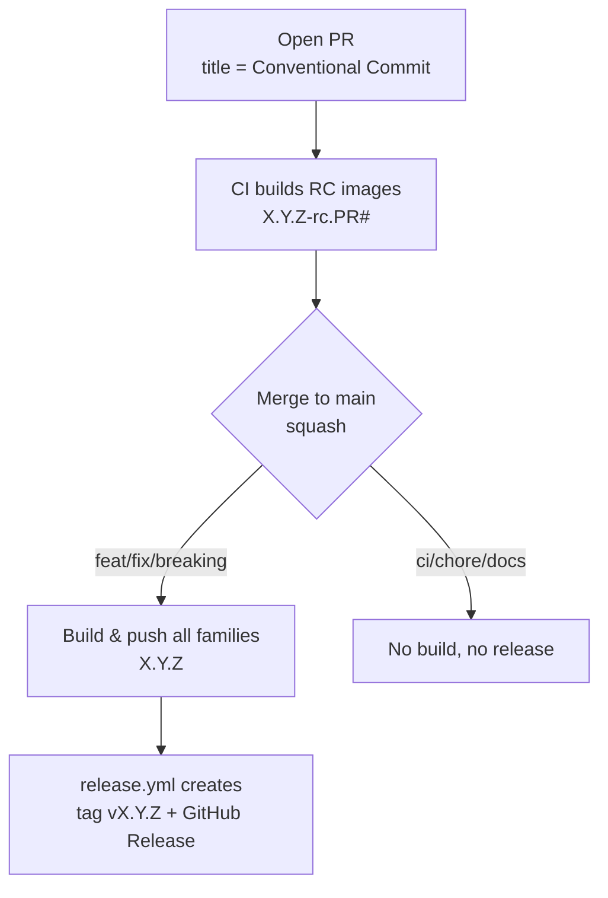

# Release process

This repository releases its container images automatically using **semantic
versioning derived from [Conventional Commits](https://www.conventionalcommits.org/)**.
There is no manual version file to bump and no manual tagging: the version is
computed from git history, images are built and pushed by CI, and a GitHub
Release + git tag are created when a releasable change lands on `main`.

- [TL;DR](#tldr)
- [Versioning rules](#versioning-rules)
- [The release flow](#the-release-flow)
- [Image tags you will see](#image-tags-you-will-see)
- [How it works under the hood](#how-it-works-under-the-hood)
- [Maintenance procedures](#maintenance-procedures)
- [Repository requirements](#repository-requirements)
- [Troubleshooting](#troubleshooting)

---

## TL;DR

1. Open a PR. **The PR title must be a Conventional Commit** (e.g. `feat: add X`) —
   we squash-merge, so the PR title becomes the commit on `main`.
2. CI builds **release-candidate** images for your PR, tagged `X.Y.Z-rc.<PR#>`.
3. Merge the PR. CI:
   - computes the next version from the commit type,
   - builds and pushes the final images `X.Y.Z`,
   - creates the git tag `vX.Y.Z` and a GitHub Release with generated notes.
4. `ci:` / `chore:` / `docs:` changes do **not** create a release.

---

## Versioning rules

The next version is `latest git tag` + a bump decided by the Conventional
Commit type:

| Commit type (PR title)                    | Example                          | Bump   | `1.0.7` becomes |
| ----------------------------------------- | -------------------------------- | ------ | --------------- |
| `feat:`                                   | `feat: add comfyui template`     | minor  | `1.1.0`         |
| `fix:` / `perf:`                          | `fix: correct cuda path`         | patch  | `1.0.8`         |
| `feat!:` / any type with `!` / `BREAKING CHANGE` | `feat!: drop ubuntu 20.04` | major  | `2.0.0`         |
| `ci:` / `chore:` / `docs:` / `refactor:` / `test:` | `ci: speed up build`   | none   | no release      |

Notes:

- **Source of truth is the git tag** `vX.Y.Z`, not any file. `RELEASE_VERSION` in
  `official-templates/shared/versions.hcl` is only a fallback default for local
  `docker buildx bake` runs; CI always overrides it.
- One global version covers **all** image families (base, pytorch,
  nvidia-pytorch, rocm, autoresearch). A release tags every family with the same
  version.

---

## The release flow



### On a pull request

- Builds **release-candidate** images for the families affected by the PR
  (path filters + `changed-files`), tagged `X.Y.Z-rc.<PR#>`.
- `X.Y.Z` is the version the merge *would* produce. If the PR is not releasable
  (`ci:`/`chore:`), the base version is kept (e.g. `1.0.7-rc.42`) — no phantom bump.
- No git tag or GitHub Release is created.
- The RC tag is reused on every push to the same PR (always the latest build).

### On merge to `main` (release)

- Only happens when the squashed commit is `feat`/`fix`/`perf`/breaking.
- Builds and pushes **all** image families with the final `X.Y.Z` tags.
- `release.yml` creates the git tag `vX.Y.Z` and a GitHub Release with
  auto-generated notes.

### Manual run (`workflow_dispatch`)

- Builds all families with a `-dev` suffix (e.g. `1.1.0-dev`).
- Never creates a tag or release. Useful for testing pipeline changes, since
  pipeline-only edits do not trigger builds automatically (see below).

---

## Image tags you will see

For the version `1.1.0` as an example:

| Context            | Suffix        | Example tag                                  |
| ------------------ | ------------- | -------------------------------------------- |
| Release (`main`)   | none          | `runpod/base:1.1.0-ubuntu2204`               |
| Pull request       | `-rc.<PR#>`   | `runpod/base:1.1.0-rc.42-ubuntu2204`         |
| Manual dispatch    | `-dev`        | `runpod/base:1.1.0-dev-ubuntu2204`           |

Image repositories: `runpod/base`, `runpod/pytorch`, `runpod/nvidia-pytorch`,
`runpod/autoresearch` (rocm images are published under `runpod/base` with a
`-rocm*` tag).

---

## How it works under the hood

| File                                             | Role                                                                 |
| ------------------------------------------------ | -------------------------------------------------------------------- |
| `.github/actions/compute-version/action.yml`     | Computes version, suffix, and the `should-build` / `should-release` flags from the latest tag + commits/PR title. |
| `.github/workflows/release.yml`                  | On push to `main`, creates the git tag `vX.Y.Z` + GitHub Release when there is a releasable change. |
| `.github/workflows/base.yml`                     | Builds base, pytorch, autoresearch. |
| `.github/workflows/nvidia.yml`                   | Builds nvidia-pytorch. |
| `.github/workflows/rocm.yml`                     | Builds rocm. |
| `official-templates/shared/versions.hcl`         | Declares the `RELEASE_VERSION` / `RELEASE_SUFFIX` bake variables (CI overrides them). |

Key behaviours:

- **`compute-version`** finds the latest `vX.Y.Z` tag (ignoring any tag that
  points at the current commit, to stay stable during the release race), reads
  the Conventional Commit type, and applies the bump. On PRs it reads the **PR
  title** (because we squash-merge); on `main` it reads the actual commits.
- **Build vs. release are decoupled.** The build workflows compute the same
  version independently and tag images with it; `release.yml` only creates the
  git tag/Release. Because every job computes the version deterministically from
  git, they always agree — no cross-workflow coordination needed.
- **Release = build everything.** On a release (or manual dispatch) all families
  are built so every image carries the release version. On a PR, only the
  families affected by the changed files are built.
- **Pipeline-only changes don't build.** A PR that only edits
  `.github/workflows/*.yml` (a `ci:` change) does not trigger image builds — the
  image contents don't change, so an RC image would be misleading. Test such
  changes with `workflow_dispatch`.

---

## Maintenance procedures

### Cut a normal release

1. Ensure your PR **title** follows Conventional Commits (`feat:` / `fix:` / …).
2. Get the PR reviewed and green (RC images build + smoke test).
3. **Squash merge** into `main`. The release is fully automatic from here.
4. Verify: a new `vX.Y.Z` tag and GitHub Release appear, and the build workflows
   publish `X.Y.Z` images.

### Ship a hotfix / patch

- Merge a PR titled `fix: …`. This bumps the patch version (e.g. `1.1.0` →
  `1.1.1`) and releases as usual.

### Ship a breaking change (major)

- Use `!` after the type or a `BREAKING CHANGE:` footer, e.g. `feat!: remove
  python 3.10 images`. This bumps the major version.

### Test a change without releasing

- **On a PR:** RC images `X.Y.Z-rc.<PR#>` are built automatically — pull and test
  those.
- **Pipeline changes:** trigger the relevant workflow manually
  (Actions → *Docker Image Build and Release* / *Nvidia* / *ROCm* →
  **Run workflow**). This produces `-dev` images and never releases.

### Intentionally avoid a release

- Title the PR `ci:`, `chore:`, `docs:`, `refactor:`, `test:`, or `style:`.
  These produce no version bump and no release.

### Re-run / recover a failed release build

- Re-run the failed workflow from the Actions tab. `compute-version` is
  idempotent: it ignores the tag on the current commit, so it recomputes the
  same version and re-publishes the images. The GitHub Release step is a no-op if
  the tag already exists.

### First release after adding this system (bootstrap)

- A `v1.0.7` tag was created to seed the starting version. If you ever need to
  re-seed (e.g. new repo), create a tag on `main`:
  ```bash
  git tag vX.Y.Z <commit-on-main>
  git push origin vX.Y.Z
  ```
  When no `vX.Y.Z` tag exists, `compute-version` falls back to the
  `RELEASE_VERSION` default in `versions.hcl`.

### Force a specific version

- Create and push the desired tag manually, e.g. to jump to `2.0.0`:
  ```bash
  git tag v2.0.0 <commit-on-main>
  git push origin v2.0.0
  ```
  Subsequent releases are computed from this tag.

---

## Repository requirements

- **Secrets:** `DOCKERHUB_USERNAME`, `DOCKERHUB_TOKEN`,
  `TESTING_RUNPOD_API_KEY`, `TESTING_RUNPOD_SSH_PRIVATE_KEY`.
- **Permissions:** `release.yml` runs with `contents: write` to create tags and
  Releases. Ensure GitHub Actions is allowed to create releases and there is no
  tag protection rule blocking the `GITHUB_TOKEN` from pushing `v*` tags.
- **Merge strategy:** the repo uses **squash merge**. The PR title is what drives
  the version, so keep it Conventional-Commit compliant.

---

## Troubleshooting

| Symptom                                            | Cause / fix                                                                 |
| -------------------------------------------------- | --------------------------------------------------------------------------- |
| Merged a PR but no release was created             | The PR title was not `feat`/`fix`/`perf`/breaking (bump = none). Rename future PRs accordingly, or push a tag manually. |
| RC image shows an unexpected version               | The version previews the *merge* result based on the PR title. Check the title's Conventional Commit type. |
| A family is missing the new version tag            | On a release all families build. If one is missing, check that workflow's run for a build/push failure. |
| Version didn't increment as expected               | Check the latest `vX.Y.Z` tag — the bump is relative to it, not to the image tags in Docker Hub. |
| Pipeline (`ci:`) PR didn't build images            | Expected: workflow-file-only changes don't trigger builds. Use `workflow_dispatch` to test. |
| The release tag was created but images are missing | The build workflows and `release.yml` run in parallel; check the build workflow logs. Re-run if needed. |
