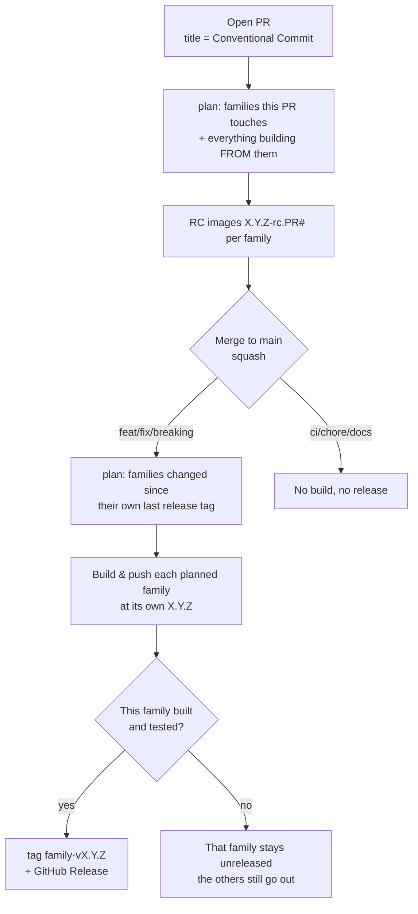

# Release process

This repository releases its container images automatically using **semantic
versioning derived from [Conventional Commits](https://www.conventionalcommits.org/)**.
There is no manual version file to bump and no manual tagging: versions are
computed from git tags, images are built and pushed by CI, and a GitHub Release
+ git tag are created when a releasable change lands on `main`.

**Every template family has its own version.** `runpod/comfyui` and
`runpod/base` move independently, each with its own tag series
(`comfyui-v1.4.0`, `base-v1.3.2`), and a merge builds and releases only the
families it actually changed, plus the families that build FROM them.

A single **orchestrator** workflow (`release.yml`, "Build and Release") plans
which families a change affects, calls only the build workflows that cover
them (reused via `workflow_call`), and tags + releases each family once its
own build has succeeded.

- [TL;DR](#tldr)
- [Versioning rules](#versioning-rules)
- [The release flow](#the-release-flow)
- [Image tags you will see](#image-tags-you-will-see)
- [How it works under the hood](#how-it-works-under-the-hood)
- [Maintenance procedures](#maintenance-procedures)
- [Repository requirements](#repository-requirements)
- [Troubleshooting](#troubleshooting)

---

## TL;DR

1. Open a PR. **The PR title must be a Conventional Commit** (e.g. `feat: add X`) —
   we squash-merge, so the PR title becomes the commit subject on `main`. For a
   breaking change use `feat!: …` in the title and preferably a `BREAKING CHANGE:`
   footer in the description.
2. CI builds **release-candidate** images for your PR, tagged `X.Y.Z-rc.<PR#>`.
3. Merge the PR. For each family your change touched, CI:
   - computes its next version from its own last tag and the commit type,
   - builds and pushes its images `X.Y.Z`,
   - creates the tag `<family>-vX.Y.Z` and a GitHub Release whose notes list
     the commits that touched that family, each with its own description.
4. Untouched families are not rebuilt and keep their published version.
5. `ci:` / `chore:` / `docs:` changes release nothing of their own. They can
   still carry out work that an earlier run left unreleased — see below.

---

## Versioning rules

A family's next version is **its own** latest tag plus a bump. The bump is the
highest Conventional Commit type among the commits that touched that family
and are not yet released:

| Commit type (PR title)                    | Example                          | Bump   | `1.0.7` becomes |
| ----------------------------------------- | -------------------------------- | ------ | --------------- |
| `feat:`                                   | `feat: add comfyui template`     | minor  | `1.1.0`         |
| `fix:` / `perf:`                          | `fix: correct cuda path`         | patch  | `1.0.8`         |
| `feat!:` / any type with `!` in the title, or a `BREAKING CHANGE:` footer | `feat!: drop ubuntu 20.04` | major  | `2.0.0`         |
| `ci:` / `chore:` / `docs:` / `refactor:` / `test:` | `ci: speed up build`   | none   | no release      |

Notes:

- **Source of truth is the family's git tag** `<family>-vX.Y.Z`, not any file.
  `RELEASE_VERSION` in `official-templates/shared/versions.hcl` is only a
  fallback default for local `docker buildx bake` runs; CI always overrides it.
- Each family has its own series, so versions drift apart: `base-v1.7.0` and
  `comfyui-v1.3.4` can be current at the same time. The bump level comes from
  the one squash commit, so families released together move by the same step.
- A family with **no tag yet** starts at exactly `1.0.0` on its first
  releasable change — the bump level is ignored, so a first `feat:` does not
  skip to `1.1.0`.
- **Breaking changes:** mark the PR title with `!` (`feat!: …`) and preferably
  add a `BREAKING CHANGE:` footer in the description. If the title has no `!`
  but the description has a proper `BREAKING CHANGE:` / `BREAKING-CHANGE:`
  footer (own line, with a colon), the release is still **major**.

---

## The release flow



### Planning

`.github/families.yml` describes every family: the paths that feed it, the
families whose published image it builds FROM, the Docker Hub repo it
publishes to, and the workflow that builds it.
`.github/scripts/plan_families.py` turns that into the list of families to
build, in dependency order — a family is selected when one of its paths
changed, and everything that builds FROM a selected family comes along after
it.

### On a pull request

- Plans against the branch the PR targets, builds **release-candidate** images
  for the planned families, tagged `X.Y.Z-rc.<PR#>` — each family at its own
  `X.Y.Z`.
- `X.Y.Z` is the version the merge *would* produce. If the PR is not releasable
  (`ci:`/`chore:`), the family's current version is kept (e.g. `1.3.2-rc.42`) —
  no phantom bump.
- No git tag or GitHub Release is created.
- The RC tag is reused on every push to the same PR (always the latest build).

### On merge to `main` (release)

- Only happens when the squashed commit is `feat`/`fix`/`perf`/breaking.
- Planning here does **not** use the push diff. Each family is compared
  against **its own last release tag**, so anything still unreleased is picked
  up — including changes from a run that failed, or from a queued run that
  GitHub dropped when a third push arrived.
- Each planned family is built, pushed at its own `X.Y.Z`, then tagged
  `<family>-vX.Y.Z` with a GitHub Release. A family is released only if the
  workflow that builds it succeeded; a broken family does not hold back the
  others, and it is planned again on the next push.
- The release body is built from the commits that touched **this family**
  (or what it builds FROM) since its previous tag: one `###` section per
  commit with its subject and the squash description that came with it, then a compare link against that
  family's previous tag. A release can carry several changes, so the newest
  squash description alone would describe the wrong one. GitHub's own note
  generation is not used either: it compares against the newest release in
  the repo, which for a per-family tag belongs to some other family.
- Pushes to `main` are **serialized** (workflow `concurrency`), so two merges
  landing close together can't race.

### Manual run (`workflow_dispatch`)

- Builds every family with a `-dev` suffix (e.g. `1.1.0-dev`).
- Never creates a tag or release. Useful for testing pipeline changes, since
  pipeline-only edits do not trigger builds automatically (see below).

---

## Image tags you will see

For the version `1.1.0` as an example:

| Context            | Suffix        | Example tag                                  |
| ------------------ | ------------- | -------------------------------------------- |
| Release (`main`)   | none          | `runpod/base:1.1.0-ubuntu2204`               |
| Pull request       | `-rc.<PR#>`   | `runpod/base:1.1.0-rc.42-ubuntu2204`         |
| Manual dispatch    | `-dev`        | `runpod/base:1.1.0-dev-ubuntu2204`           |

Image repositories: one per template family, listed in `.github/families.yml`
(`python3 .github/scripts/plan_families.py --image-repos`).

---

## How it works under the hood

| File                                             | Role                                                                 |
| ------------------------------------------------ | -------------------------------------------------------------------- |
| `.github/families.yml`                           | The family graph: paths, `depends_on`, `image_repo`, `workflow`. Single source of truth for what exists and what feeds it. |
| `.github/scripts/plan_families.py`               | Turns a diff (or each family's last tag) into the families to build, in dependency order. Also answers which workflows to call and which repos we publish to. |
| `.github/workflows/release.yml`                  | **Orchestrator** ("Build and Release"). Owns all triggers, plans the families (`plan` job), calls only the build workflows it needs, and creates one `<family>-vX.Y.Z` tag + Release per family. |
| `.github/actions/compute-version/action.yml`     | For one family: its next version, suffix, `previous-version`, and the `should-build` / `should-release` flags, from its own tag series + the commit type. |
| `.github/workflows/base.yml`                     | **Reusable** (`workflow_call`). Covers base, pytorch, pytorch-cluster, autoresearch; builds the ones in the plan. |
| `.github/workflows/nvidia.yml`, `rocm.yml`, `comfyui.yml` | **Reusable** (`workflow_call`). One family each. |
| `.github/scripts/release_notes.py`               | Builds a family's release body from the commits that touched it since its previous tag. |
| `.github/workflows/manual-release.yml`           | Break-glass: tags one family from an earlier run's commit when its release never happened. |
| `.github/workflows/release-plan.yml`             | Guards the graph: unit tests, plus a check that every template directory appears in it. |
| `official-templates/shared/versions.hcl`         | Declares the `RELEASE_VERSION` / `RELEASE_SUFFIX` bake variables (CI overrides them). |

Key behaviours:

- **One version per family.** Each build workflow runs `compute-version` for
  the families it covers, tags its images from that, and builds a family only
  when that family has something releasable. The orchestrator decides only
  *which* families are in play.
- **`compute-version`** finds the latest `<family>-vX.Y.Z` tag that is
  **reachable from HEAD** (skipping any tag on the current commit, to stay
  stable during the release step, and any tag not in HEAD's history, so
  re-running an older commit doesn't pick up a newer unrelated tag).
- **The bump covers everything unreleased.** On `main` it is the highest type
  among the commits between that tag and HEAD that touched the family's paths
  **or the paths of a family it builds FROM** — so a feature that arrived in a
  run which failed still ships as a minor, and a fix in base bumps and
  rebuilds pytorch, autoresearch and pytorch-cluster with it. On a PR the bump comes from the **PR title**,
  which is the subject the squash will produce. A major bump is `type!:` in
  the subject **or** a git-trailer `BREAKING CHANGE:` / `BREAKING-CHANGE:`
  footer in the body. Body lines like `* feat: …` from a squash are ignored.
- **A family with nothing releasable is skipped.** If its unreleased commits
  are all `chore:`/`ci:`/`docs:`, its bump is `none`, and it is neither built
  nor released — its published images keep their version instead of being
  overwritten.
- **Each family waits only on itself.** The `release` job is a matrix over the
  planned families; a leg publishes only if the workflow that builds its family
  succeeded. One failing scan no longer keeps the other families unreleased
  while their images are already pushed.
- **A dependent uses the published base when its base is not rebuilt.**
  pytorch layers onto the last released `runpod/base` unless base is in the
  same plan (`BASE_VERSION` / `PYTORCH_BASE_VERSION` in the bake files), so
  changing pytorch alone does not rebuild base.
- **Nothing is lost between runs.** On `main` the plan comes from each
  family's last release tag, not from the push diff, so a family whose build
  failed — or whose run was dropped from the queue — is planned again on the
  next push.
- **Pipeline-only changes don't build.** The orchestrator triggers only on
  `official-templates/**` and `container-template/**`, so a PR that only edits
  workflow/action files (a `ci:` change) does not trigger image builds — the
  image contents don't change, so an RC image would be misleading. Test such
  changes with `workflow_dispatch`.

---

## Maintenance procedures

### Cut a normal release

1. Ensure your PR **title** follows Conventional Commits (`feat:` / `fix:` / …).
2. Get the PR reviewed and green (RC images build + smoke test). The squash
   **description** becomes the release notes for the families this PR touches
   — GitHub pre-fills it with the branch's commit list, so replace that with
   something a reader would want.
3. **Squash merge** into `main`. The release is fully automatic from here.
4. Verify: a `<family>-vX.Y.Z` tag and Release appear for each family your
   change touched, and those families publish `X.Y.Z` images. Families you did
   not touch stay where they were.

### Ship a hotfix / patch

- Merge a PR titled `fix: …`. This bumps the patch version (e.g. `1.1.0` →
  `1.1.1`) and releases as usual.

### Ship a breaking change (major)

Mark it in the **PR title** with `!` after the type, and preferably also add a
footer in the PR description:

```
feat!: remove python 3.10 images

BREAKING CHANGE: python 3.10 images are no longer published
```

On squash-merge the title becomes the commit subject and the description
becomes the body, so both signals land in git.

If the title has no `!` but the description contains a footer on its own line
(`BREAKING CHANGE:` or `BREAKING-CHANGE:`, with a colon), the release is still
major. A mention of "BREAKING CHANGE" in prose that is not that footer does
not count. `feat:` / `fix:` lines listed in the squash body do not count
either.

### Test a change without releasing

- **On a PR:** RC images `X.Y.Z-rc.<PR#>` are built automatically — pull and test
  those.
- **Pipeline changes:** trigger the orchestrator manually
  (Actions → *Build and Release* → **Run workflow**). It builds every family
  with `-dev` images and never releases. (The per-family workflows are reusable
  and can't be dispatched on their own.)

### Intentionally avoid a release

- Title the PR `ci:`, `chore:`, `docs:`, `refactor:`, `test:`, or `style:`.
  These produce no version bump and no release.

### Re-run / recover a failed release build

- **Usually: do nothing.** A family that failed keeps no tag, so the next push
  to `main` plans it again and releases it then.
- To get it out sooner, re-run the failed run from the Actions tab.
  `compute-version` is idempotent — it ignores a tag on the current commit, so
  it recomputes the same version — and only the families still missing a tag
  are affected.
- If the images were already pushed but the tag never appeared (e.g. the run
  was cancelled after the push), use *Manual Release (break-glass)* with the
  family, the tag and the original run ID. It checks that this family's jobs
  succeeded in that run and that its images are on Docker Hub, then creates
  the tag and Release without rebuilding.

### Add a new template

1. Add its directory under `official-templates/`, its build job in the right
   reusable workflow, and its entry in `.github/families.yml`. The *Release
   Plan* check fails if the graph and the directories disagree.
2. Do **not** create a seed tag: a family with no tag is released as `1.0.0`.

### Seed a family that already has published images

- Only needed when a family existed before it had its own tag series. Point
  the tag at the commit of its last release:
  ```bash
  git tag <family>-vX.Y.Z <commit-on-main>
  git push origin <family>-vX.Y.Z
  ```
  Without it the family would be treated as never released and go out as
  `1.0.0`.

### Force a specific version

- Create and push the desired tag for that family, e.g. to jump to `2.0.0`:
  ```bash
  git tag comfyui-v2.0.0 <commit-on-main>
  git push origin comfyui-v2.0.0
  ```
  Its subsequent releases are computed from this tag.

---

## Repository requirements

- **Secrets:** `DOCKERHUB_USERNAME`, `DOCKERHUB_TOKEN`,
  `TESTING_RUNPOD_API_KEY`, `TESTING_RUNPOD_SSH_PRIVATE_KEY`.
- **Permissions:** the orchestrator grants `id-token: write` (for Cosign
  signing in the reusable builds) and its `release` job uses `contents: write`
  to create tags and Releases. Ensure GitHub Actions is allowed to create
  releases and there is no tag protection rule blocking the `GITHUB_TOKEN` from
  pushing `v*` tags.
- **Required status checks:** builds run under the orchestrator, so checks
  appear as `Build and Release / <workflow> / <job>` (e.g.
  `Build and Release / base / build-base`). A family not in the plan reports
  as skipped, and the `release` job is a matrix (`release (comfyui)`), so keep
  branch-protection required checks to ones that always run — `plan`, and the
  lint/test workflows.
- **Merge strategy:** the repo uses **squash merge**. The PR title is what drives
  the version, so keep it Conventional-Commit compliant.
- **Blacksmith sticky disks:** PR builds write a separate `/pr` cache lineage
  (`docker-setup`) so they cannot poison the keys used by main/release. Also
  enable Sticky Disk **Branch Protection** in the Blacksmith dashboard — that
  setting is not in git.

---

## Troubleshooting

| Symptom                                            | Cause / fix                                                                 |
| -------------------------------------------------- | --------------------------------------------------------------------------- |
| Merged a PR but no release was created             | The PR title was not `feat`/`fix`/`perf`/breaking (bump = none). Rename future PRs accordingly, or push a tag manually. |
| RC image shows an unexpected version               | The version previews the *merge* result based on the PR title. Check the title's Conventional Commit type. |
| A family did not get a new version                 | Either nothing under its `paths` changed since its last tag (expected), or its build failed — open the *Build and Release* run and check that family's job. It will be planned again on the next push. |
| Version didn't increment as expected               | Check that family's latest `<family>-vX.Y.Z` tag — the bump is relative to it, not to the image tags in Docker Hub, and not to another family's version. |
| Pipeline (`ci:`) PR didn't build images            | Expected: workflow-file-only changes don't trigger builds. Use `workflow_dispatch` to test. |
| No release despite a `feat`/`fix` merge to `main`  | The change may not touch any family's `paths` (check the `plan` job's log), or that family's build failed — its Release is skipped with a warning while the others go out. |
| A family released at a higher bump than the merge  | Expected: the bump covers everything the family still had unreleased, so an older `feat:` outranks today's `fix:`. |
| PR checks are stuck "Expected"/pending             | Branch-protection required checks likely still reference the old workflow names. Update them to the `Build and Release / …` check names. |
