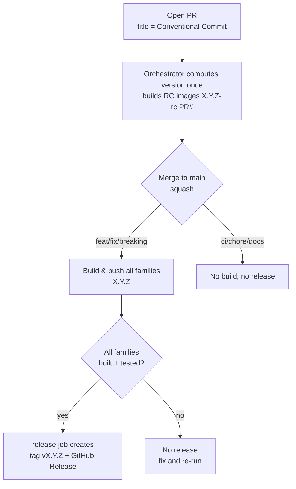

# Release process

This repository releases its container images automatically using **semantic
versioning derived from [Conventional Commits](https://www.conventionalcommits.org/)**.
There is no manual version file to bump and no manual tagging: the version is
computed from git history, images are built and pushed by CI, and a GitHub
Release + git tag are created when a releasable change lands on `main`.

A single **orchestrator** workflow (`release.yml`, "Build and Release") computes
the version **once**, fans out to the per-family build workflows (reused via
`workflow_call`), waits for all of them, and only then tags + releases — so the
builds and the release can never disagree on the version, and a release is never
cut while a family is still building or has failed.

- [TL;DR](#tldr)
- [Versioning rules](#versioning-rules)
- [The release flow](#the-release-flow)
- [Image tags you will see](#image-tags-you-will-see)
- [How it works under the hood](#how-it-works-under-the-hood)
- [Maintenance procedures](#maintenance-procedures)
- [Repository requirements](#repository-requirements)
- [Troubleshooting](#troubleshooting)

---

## TL;DR

1. Open a PR. **The PR title must be a Conventional Commit** (e.g. `feat: add X`) —
   we squash-merge, so the PR title becomes the commit on `main`.
2. CI builds **release-candidate** images for your PR, tagged `X.Y.Z-rc.<PR#>`.
3. Merge the PR. CI:
   - computes the next version from the commit type,
   - builds and pushes the final images `X.Y.Z`,
   - creates the git tag `vX.Y.Z` and a GitHub Release with generated notes.
4. `ci:` / `chore:` / `docs:` changes do **not** create a release.

---

## Versioning rules

The next version is `latest git tag` + a bump decided by the Conventional
Commit type:

| Commit type (PR title)                    | Example                          | Bump   | `1.0.7` becomes |
| ----------------------------------------- | -------------------------------- | ------ | --------------- |
| `feat:`                                   | `feat: add comfyui template`     | minor  | `1.1.0`         |
| `fix:` / `perf:`                          | `fix: correct cuda path`         | patch  | `1.0.8`         |
| `feat!:` / any type with `!` in the subject, or a `BREAKING CHANGE:` footer | `feat!: drop ubuntu 20.04` | major  | `2.0.0`         |
| `ci:` / `chore:` / `docs:` / `refactor:` / `test:` | `ci: speed up build`   | none   | no release      |

Notes:

- **Source of truth is the git tag** `vX.Y.Z`, not any file. `RELEASE_VERSION` in
  `official-templates/shared/versions.hcl` is only a fallback default for local
  `docker buildx bake` runs; CI always overrides it.
- One global version covers **all** image families (base, pytorch,
  nvidia-pytorch, rocm, autoresearch). A release tags every family with the same
  version.

---

## The release flow



### On a pull request

- Builds **release-candidate** images for the families affected by the PR
  (path filters + `changed-files`), tagged `X.Y.Z-rc.<PR#>`.
- `X.Y.Z` is the version the merge *would* produce. If the PR is not releasable
  (`ci:`/`chore:`), the base version is kept (e.g. `1.0.7-rc.42`) — no phantom bump.
- No git tag or GitHub Release is created.
- The RC tag is reused on every push to the same PR (always the latest build).

### On merge to `main` (release)

- Only happens when the squashed commit is `feat`/`fix`/`perf`/breaking.
- Builds and pushes **all** image families with the final `X.Y.Z` tags.
- The orchestrator's `release` job creates the git tag `vX.Y.Z` and a GitHub
  Release with auto-generated notes — **only after every family built and
  smoke-tested successfully**. If any family fails, no release is cut.
- Pushes to `main` are **serialized** (workflow `concurrency`), so two merges
  landing close together can't compute the same version or race — the second
  waits for the first to finish and tag.

### Manual run (`workflow_dispatch`)

- Builds all families with a `-dev` suffix (e.g. `1.1.0-dev`).
- Never creates a tag or release. Useful for testing pipeline changes, since
  pipeline-only edits do not trigger builds automatically (see below).

---

## Image tags you will see

For the version `1.1.0` as an example:

| Context            | Suffix        | Example tag                                  |
| ------------------ | ------------- | -------------------------------------------- |
| Release (`main`)   | none          | `runpod/base:1.1.0-ubuntu2204`               |
| Pull request       | `-rc.<PR#>`   | `runpod/base:1.1.0-rc.42-ubuntu2204`         |
| Manual dispatch    | `-dev`        | `runpod/base:1.1.0-dev-ubuntu2204`           |

Image repositories: `runpod/base`, `runpod/pytorch`, `runpod/nvidia-pytorch`,
`runpod/autoresearch` (rocm images are published under `runpod/base` with a
`-rocm*` tag).

---

## How it works under the hood

| File                                             | Role                                                                 |
| ------------------------------------------------ | -------------------------------------------------------------------- |
| `.github/workflows/release.yml`                  | **Orchestrator** ("Build and Release"). Owns all triggers, computes the version once (`version` job), gates which families build on a PR (`changes` job), calls the reusable build workflows, and creates the tag `vX.Y.Z` + GitHub Release once every family succeeds. |
| `.github/actions/compute-version/action.yml`     | Computes version, suffix, `base-version`, and the `should-build` / `should-release` flags from the latest tag + commit subject / `BREAKING CHANGE:` footer. |
| `.github/workflows/manual-release.yml`           | Break-glass: creates the git tag + GitHub Release for an already-built version, pinned to the original *Build and Release* run's commit after verifying that run and the image manifests. |
| `.github/workflows/base.yml`                     | **Reusable** (`workflow_call`). Builds base → pytorch → {autoresearch, pytorch-cluster}. |
| `.github/workflows/nvidia.yml`                   | **Reusable** (`workflow_call`). Builds nvidia-pytorch. |
| `.github/workflows/rocm.yml`                     | **Reusable** (`workflow_call`). Builds rocm. |
| `official-templates/shared/versions.hcl`         | Declares the `RELEASE_VERSION` / `RELEASE_SUFFIX` bake variables (CI overrides them). |

Key behaviours:

- **Version is computed once.** The orchestrator's `version` job runs
  `compute-version` a single time and passes `version`/`suffix`/`base-version`
  into every reusable build workflow via `workflow_call` inputs — the builds and
  the release can't disagree.
- **`compute-version`** finds the latest `vX.Y.Z` tag that is **reachable from
  HEAD** (skipping any tag on the current commit, to stay stable during the
  release step, and any tag not in HEAD's history, so re-running an older commit
  doesn't pick up a newer unrelated tag). It reads the Conventional Commit type
  and applies the bump. The **subject** (PR title / squash-commit first line)
  decides `feat`/`fix`/`perf`/`none`; a major bump is `type!:` in that subject
  **or** a git-trailer `BREAKING CHANGE:` / `BREAKING-CHANGE:` footer. Body
  lines like `* feat: …` from a squash description are ignored, so they cannot
  phantom-bump a `ci:`/`chore:` merge.
- **Release waits for the builds.** The `release` job `needs` every family and
  only tags/releases when all of them succeeded on a `push` to `main` — never a
  partial release. Pushes to `main` are serialized via `concurrency` to avoid a
  version race between near-simultaneous merges.
- **Release = build everything.** On a release (or manual dispatch) all families
  are built so every image carries the release version. On a PR, only the
  families affected by the changed files are built (the `changes` job gates which
  reusable workflows are called).
- **Pipeline-only changes don't build.** The orchestrator triggers only on
  `official-templates/**` and `container-template/**`, so a PR that only edits
  workflow/action files (a `ci:` change) does not trigger image builds — the
  image contents don't change, so an RC image would be misleading. Test such
  changes with `workflow_dispatch`.

---

## Maintenance procedures

### Cut a normal release

1. Ensure your PR **title** follows Conventional Commits (`feat:` / `fix:` / …).
2. Get the PR reviewed and green (RC images build + smoke test).
3. **Squash merge** into `main`. The release is fully automatic from here.
4. Verify: a new `vX.Y.Z` tag and GitHub Release appear, and the build workflows
   publish `X.Y.Z` images.

### Ship a hotfix / patch

- Merge a PR titled `fix: …`. This bumps the patch version (e.g. `1.1.0` →
  `1.1.1`) and releases as usual.

### Ship a breaking change (major)

- Put `!` after the type in the **PR title** (the squash subject), e.g.
  `feat!: remove python 3.10 images`, **or** add a git-trailer footer on its
  own line in the PR description:
  ```
  BREAKING CHANGE: remove the previous interface
  ```
  Either form bumps the major version. A `BREAKING CHANGE` mention in prose
  that is not a trailer (no leading `BREAKING CHANGE:`) does not.

### Test a change without releasing

- **On a PR:** RC images `X.Y.Z-rc.<PR#>` are built automatically — pull and test
  those.
- **Pipeline changes:** trigger the orchestrator manually
  (Actions → *Build and Release* → **Run workflow**). It builds every family
  with `-dev` images and never releases. (The per-family workflows are reusable
  and can't be dispatched on their own.)

### Intentionally avoid a release

- Title the PR `ci:`, `chore:`, `docs:`, `refactor:`, `test:`, or `style:`.
  These produce no version bump and no release.

### Re-run / recover a failed release build

- Re-run the failed *Build and Release* run from the Actions tab. The whole
  pipeline (version → builds → release) reruns in order. `compute-version` is
  idempotent: it ignores the tag on the current commit, so it recomputes the
  same version and re-publishes the images, and the release step only fires once
  every family succeeds. The GitHub Release step is a no-op if the tag already
  exists.

### Recover a skipped `release` job (break-glass)

If a flaky family build failed, `release` was **skipped**, and "Re-run failed
jobs" later made the builds succeed but left `release` skipped, do **not**
dispatch *Manual Release* with only a tag — that would tag current `main`,
which may already have moved.

1. Note the original *Build and Release* run ID (the run that pushed the
   images) and the version tag it computed (e.g. `v1.1.0`).
2. On `main`, run **Actions → Manual Release (break-glass) → Run workflow**
   with `tag=v1.1.0` and `source_run_id=<that run ID>`.
3. The workflow verifies the run was a `push` to `main` of `release.yml`,
   that `version`/`base`/`nvidia`/`rocm` succeeded, that the run's commit is
   still on `main`, that `compute-version` at that commit matches the tag,
   and that every bake-defined image manifest for that version exists. It
   then creates the git tag **on that commit** and the GitHub Release.

### First release after adding this system (bootstrap)

- A `v1.0.7` tag was created to seed the starting version. If you ever need to
  re-seed (e.g. new repo), create a tag on `main`:
  ```bash
  git tag vX.Y.Z <commit-on-main>
  git push origin vX.Y.Z
  ```
  When no `vX.Y.Z` tag exists, `compute-version` falls back to the
  `RELEASE_VERSION` default in `versions.hcl`.

### Force a specific version

- Create and push the desired tag manually, e.g. to jump to `2.0.0`:
  ```bash
  git tag v2.0.0 <commit-on-main>
  git push origin v2.0.0
  ```
  Subsequent releases are computed from this tag.

---

## Repository requirements

- **Secrets:** `DOCKERHUB_USERNAME`, `DOCKERHUB_TOKEN`,
  `TESTING_RUNPOD_API_KEY`, `TESTING_RUNPOD_SSH_PRIVATE_KEY`.
- **Permissions:** the orchestrator grants `id-token: write` (for Cosign
  signing in the reusable builds) and its `release` job uses `contents: write`
  to create tags and Releases. Ensure GitHub Actions is allowed to create
  releases and there is no tag protection rule blocking the `GITHUB_TOKEN` from
  pushing `v*` tags.
- **Required status checks:** builds run under the orchestrator, so checks appear
  as `Build and Release / <family> / <job>` (e.g.
  `Build and Release / base / build-base`). Update branch-protection required
  checks to these names — the old standalone workflow names no longer report.
- **Merge strategy:** the repo uses **squash merge**. The PR title is what drives
  the version, so keep it Conventional-Commit compliant.
- **Blacksmith sticky disks:** PR builds write a separate `/pr` cache lineage
  from main/release (see `docker-setup`). Also enable Sticky Disk **Branch
  Protection** in the Blacksmith dashboard so untrusted jobs cannot commit into
  trusted disks even if a key is shared by mistake.

---

## Troubleshooting

| Symptom                                            | Cause / fix                                                                 |
| -------------------------------------------------- | --------------------------------------------------------------------------- |
| Merged a PR but no release was created             | The PR title was not `feat`/`fix`/`perf`/breaking (bump = none). Rename future PRs accordingly, or push a tag manually. |
| RC image shows an unexpected version               | The version previews the *merge* result based on the PR title. Check the title's Conventional Commit type. |
| A family is missing the new version tag            | On a release all families build. If one is missing, open the *Build and Release* run and check that family's job for a build/push failure. |
| Version didn't increment as expected               | Check the latest `vX.Y.Z` tag — the bump is relative to it, not to the image tags in Docker Hub. |
| Pipeline (`ci:`) PR didn't build images            | Expected: workflow-file-only changes don't trigger builds. Use `workflow_dispatch` to test. |
| No release despite a `feat`/`fix` merge to `main`  | The `release` job only fires after **every** family succeeds. If a build/test failed, no tag/Release is created — fix the failure and re-run the *Build and Release* run. If `release` stayed `skipped` after a successful re-run of failed jobs, use [Manual Release](#recover-a-skipped-release-job-break-glass) with the original run ID. |
| PR checks are stuck "Expected"/pending             | Branch-protection required checks likely still reference the old workflow names. Update them to the `Build and Release / …` check names. |
